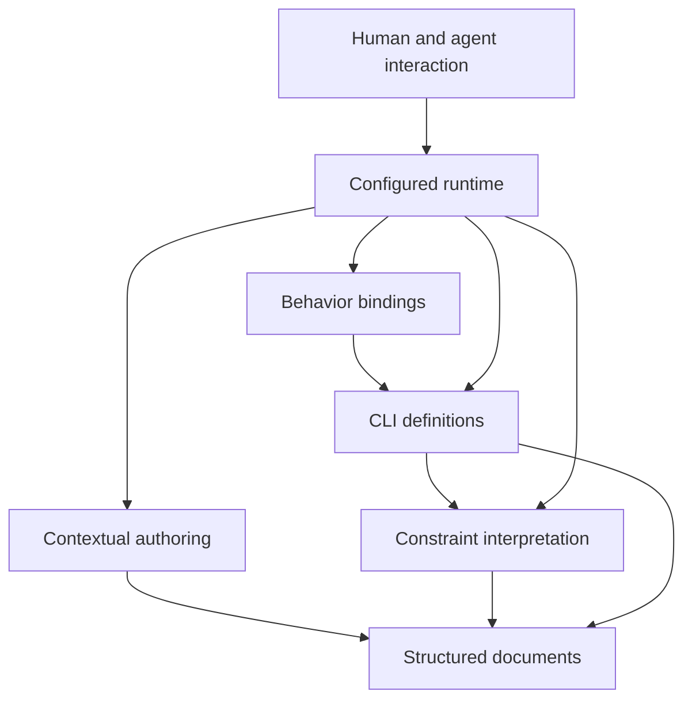
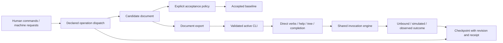

# Programmable CLI architecture

This document describes the target responsibility model at the system altitude.\
Its statements use the present tense of that target; section maturity identifies which contracts are specified and which boundaries remain proposals.\
It is not a certification of current implementation.\
The [workflow and evidence index](README.md) identifies available behavior, and the [source map](CONTRIBUTING.md#source-map) locates its Rust implementation.

The [vision](../VISION.md) owns purpose.\
The [board](BOARD.md) owns selected work and ordering.\
Implementation history belongs to the linked results and backlog, rather than to the architecture's target instant.

## Identity and scope

**Maturity: owner intent recorded; responsibility decomposition provisional.**

Programmable CLI interprets structured definitions as discoverable, contextual interfaces.\
Its authoring workflow constructs JSON documents and the definitions that configure those interfaces.\
A schema can be authored as ordinary data or explicitly attached as a constraint.\
A CLI can be explored with declared and simulated behavior before a real capability is attached.

| In scope | Boundary |
|---|---|
| Progressive construction | Incomplete drafts remain inspectable and resumable. |
| Configured interaction | Definitions determine contexts, command contracts, help, and completion. |
| Reusable composition | Dependencies, identity, state ownership, and incompatibilities stay explicit. |
| Human and agent use | Presentations share operation meaning and distinguish known outcomes. |
| Portable continuity | Data, intent, drafts, and observations retain their provenance. |
| Explicit behavior | An unbound verb declares a need; a mock simulates; a connected capability reports its actual evidence. |

The system does not invent functionality from a verb name or acquire authority by importing a definition.\
A document's ownership tree is distinct from the graph of relationships it describes.\
Local document acceptance does not prove an external system changed, and historical observations do not prove current liveness.\
The kernel is not an autonomous agent coordinator or a general operating-system sandbox.

---

## Justification chain

**Maturity: derived from recorded intent; the linked bounded contracts have their own selection records.**

| Step | Constraint on this design |
|---|---|
| Domain | People and agents construct and consume structured interfaces while preserving meaning across edits and handovers. |
| First principles | [A3](https://github.com/apnex/mission-kit/blob/main/axioms/A3-sovereign-composition.md) isolates concerns; [A4](https://github.com/apnex/mission-kit/blob/main/axioms/A4-zero-loss-knowledge.md) preserves source meaning; [A5](https://github.com/apnex/mission-kit/blob/main/axioms/A5-perceptual-parity.md) interrogates shared perception; [A11](https://github.com/apnex/mission-kit/blob/main/axioms/A11-cognitive-minimalism.md) places deterministic interpretation in code. |
| System north star | One declared operation model determines discoverable choices and execution meaning while retaining enough explicit state for another actor to continue. |
| Principles | Authoring is independently useful; activation is explicit; acceptance is local; authority is separately granted; outcome classification survives transfer. |
| Decisions | [The bounded authoring decision](authoring/CLI-001.md#decision-0001-establish-the-bounded-authoring-contract) and selected [composition](composition/CONTRACT.md), [constraint](constraints/CONTRACT.md), [component](components/CONTRACT.md), [connected](connected/CONTRACT.md), and [run](run/CONTRACT.md) contracts define concrete obligations. |
| Model | The following registry assigns one duty to each responsibility and declares its semantic dependencies. |

The [verbs-as-data pattern](https://github.com/apnex/mission-kit/blob/main/patterns/P5-verbs-as-data-surface.md) grounds shared discovery and dispatch.\
Implemented handlers must satisfy their declarations; explicitly unbound and simulated domain operations remain valid definition states.\
The owner selected bounded implementation journeys, not a stable public API for every proposed layer.\
Specification size remains separate from the economic value of constructing and reusing it.

---

## Anchored core

**Maturity: proposed semantic boundaries; generated from the layer registry.**

The [registry](layers.json) is the source of this map and the local responsibility records.\
A dependency arrow names a semantic dependency; it does not assert a Rust import, separate crate, process boundary, or independently certified subsystem.

<!-- BEGIN GENERATED LAYER MAP -->
| Responsibility | Duty | Consumes | Exposes | Depends on | Local record |
|---|---|---|---|---|---|
| `document` | Own the structured document model. | JSON values; Unambiguous document locations; Proposed document transformations | Typed values and document locations; Snapshots and structural differences; Explicit transformation results | None | [Vision](layers/document/VISION.md), [responsibility](layers/document/contract.md) |
| `authoring` | Own the authoring session. | Document snapshots; Explicit editing intentions; A declared acceptance policy | Working context and candidate state; Atomic edit and batch results; Pending changes and resumable session state | `document` | [Vision](layers/authoring/VISION.md), [responsibility](layers/authoring/contract.md) |
| `constraints` | Own constraint interpretation. | A document under evaluation; An explicitly selected schema and dialect; Reference-resolution inputs | Validation findings with document and schema locations; Supported constraint semantics; Contextual guidance with stated completeness limits | `document` | [Vision](layers/constraints/VISION.md), [responsibility](layers/constraints/contract.md) |
| `definitions` | Own the declarative CLI model. | Authored CLI definitions; Referenced schemas and reusable components; Declared operation expectations | An inspectable model of contexts and operations; Explicit references between modeled entities; Definition diagnostics and dependency requirements | `document`, `constraints` | [Vision](layers/definitions/VISION.md), [responsibility](layers/definitions/contract.md) |
| `bindings` | Own operation-to-behavior bindings. | Declared operation contracts; Explicit mock behavior or connected capabilities; Granted execution authority | Binding availability and compatibility; Distinguishable unbound, simulated, and real invocation outcomes; Effect evidence and uncertainty supplied by the connected capability | `definitions` | [Vision](layers/bindings/VISION.md), [responsibility](layers/bindings/contract.md) |
| `runtime` | Own configured operation dispatch. | An explicitly activated CLI definition; An identified session and operation request; Authoring, constraint, and binding results | Available operations in the current context; Definition and state identity for each request; Structured operation results and resulting context | `authoring`, `constraints`, `definitions`, `bindings` | [Vision](layers/runtime/VISION.md), [responsibility](layers/runtime/contract.md) |
| `interaction` | Own interaction presentation. | Runtime discovery and operation results; Human input or agent requests; Presentation preferences | Contextual navigation, help, and completion; Structured machine interaction; Visible results with accessible detail and provenance | `runtime` | [Vision](layers/interaction/VISION.md), [responsibility](layers/interaction/contract.md) |

Arrows point from a consumer to its declared dependency.

<!-- END GENERATED LAYER MAP -->

---

## Entity model and interfaces

**Maturity: conceptual entities; the linked serialization and operation contracts specify bounded behavior.**

| Entity | Meaning | Owning contract |
|---|---|---|
| Document | Exact typed values at explicit object keys and positional array locations. | [Document fidelity](authoring/SESSION-CONTRACT.md#document-fidelity) |
| Authoring session | Candidate, accepted baseline, document context, original intent, revision, and latest receipt. | [Session and persistence](authoring/SESSION-CONTRACT.md) |
| Constraint attachment | An identified schema snapshot and selected interpretation governing a candidate. | [Constraint interpretation](constraints/CONTRACT.md#interpretation) |
| CLI definition | Stable context and operation identities, command parameters, relationships, and behavior declarations. | [Definition vocabulary](composition/CONTRACT.md) |
| Component assembly | Explicit source components, dependencies, namespaces, and ownership of mock state. | [Local assembly](components/CONTRACT.md) |
| Active interface | A validated definition selected for discovery and invocation, with its own navigation and runtime state. | [Activation and bindings](composition/CONTRACT.md) |
| Capability grant | Process authority to use a specific connected capability. | [Connected read authority](connected/CONTRACT.md) |
| Invocation record | Definition identity, inputs, outcome classification, and any supported observation evidence. | [Invocation and transfer](connected/CONTRACT.md) |
| Presentation route | A validated path from command words to the same operation contract used by the runtime. | [Direct run mode](run/CONTRACT.md) |

The [authoring declaration](authoring/operations.json) and its [composition](composition/operations.json) and [constraint](constraints/operations.json) extensions describe the kernel's supported operation surface.\
The authoring document, accepted baseline, and active CLI definition have separate identities and transitions.\
Editing one does not silently activate another.

---

## Runtime behavior

**Maturity: specified within the linked local contracts; additional capabilities require their own contracts.**

### Authoring and acceptance

An edit produces its declared transition or an explicit rejection.\
Intermediate containers and scalar kinds are explicit; paths do not infer array identity solely from a numeric spelling.\
A batch publishes all of its edits as one transition or preserves the preceding state.\
A draft may remain incomplete until the attached acceptance policy is satisfied.

`commit` accepts the candidate as the local baseline.\
It does not deploy configuration to an external system.\
`save` exports candidate JSON without accepting it; `import` replaces the candidate without silently changing acceptance, schema attachment, or activation.

### Activation and consumption

A validated definition supplies available contexts and commands.\
Authoring controls can inspect and exercise that interface during construction.\
Run mode presents the configured commands directly and uses reserved colon controls for its own navigation.\
One validated route projection supplies run parsing, help, tree output, and completion.

A context-only command changes the run cursor in a stream or terminal session.\
A qualified invocation resolves an operation without publishing a separate navigation change.\
One-shot command paths start at root.\
Command argument text reaches the same typed invocation engine without a second shell expansion.

### Persistence and recovery

A successful state transition checkpoints the complete session and latest receipt before acknowledgment.\
A stable sidecar lock serializes cooperating processes; checkpoints are published through the [storage protocol](authoring/SESSION-CONTRACT.md#persistence-and-export).\
Known failures preserve the previous state, while uncertain publication stops writes until reopening resolves the durable record.\
A lost response can follow durable execution, so recovery inspects the latest receipt before retrying.

A named run session retains its checkpoint.\
An unnamed run uses temporary state that is removed on normal exit.\
A checkpoint requires its exact compatible kernel declaration; a portable interface export carries the interface without migrating old kernel receipts.\
The local storage contract does not promise protection against an uncooperative filesystem writer or universal hardware power-loss behavior.

### Behavior and authority

Unbound operations expose intended functionality without pretending to execute it.\
Mocks retain simulation labels through presentation, receipts, and export.\
Connected operations use authority granted outside the imported definition.\
The selected native JSON read provider pins a parent directory and reads bounded regular-file bytes through an explicit process grant.

A fresh connected call requires a current grant.\
Replaying an exact saved receipt returns a historical result without claiming a new observation.\
Neither transferred history nor a self-authored CLI enlarges authority.\
Local transaction atomicity does not imply atomicity of external effects.

---

## Verification obligations

**Maturity: explicit local acceptance contracts; independent whole-system certification is not claimed.**

| Claim | Falsifying observation | Evidence route |
|---|---|---|
| Precise authoring | An edit loses a type, number token, unusual key, unrelated value, or failed-batch state. | [Authoring results](authoring/CLI-002.md) |
| Constraint fidelity | Supported schemas disagree with independent cases, or unsupported semantics are silently accepted. | [Constraint results](constraints/CLI-004.md), [upstream corpus provenance](constraints/acceptance/upstream/README.md) |
| Declaration integrity | Discovery, parsing, and registered behavior accept incompatible operation contracts. | [Authoring acceptance](authoring/CLI-002.md) |
| Honest simulation | A mock loses its outcome classification during use or transfer. | [Composition results](composition/CLI-003.md) |
| Composable reuse | State or command identities collide without rejection or source meaning changes on transfer. | [Component results](components/RESULTS.md) |
| Bounded external authority | A definition or receipt permits a fresh ungranted read. | [Connected results](connected/RESULTS.md) |
| Presentation parity | Direct and authoring invocation interpret equivalent commands differently. | [Run results](run/RESULTS.md) |
| Resumption | A fresh actor cannot complete the original task from the provided artifacts. | [Fresh-agent trial and exposure limits](reuse/FRESH-ACTOR-TRIAL.md) |
| Reproducible source use | A new consumer needs undocumented local products to build or execute a guide. | [Publication review](publication/REVIEW.md) |

Source inspection establishes mechanism; task assertions and executable probes establish bounded behavior.\
Historical passing evidence identifies its source and environment rather than certifying all later revisions.\
A generated responsibility map and internally consistent documents are not application tests.\
The [contributor workflow](CONTRIBUTING.md#verification) provides the repeatable checks.

---

## Axiom alignment and tensions

**Maturity: bounded design audits retained; repository-wide applicability and gaps are explicit in the publication review.**

| Tension | Resolution at this altitude |
|---|---|
| Reuse versus speculative public boundaries | Keep internal responsibilities; earn stable exported APIs through concrete consumers. |
| Complete knowledge versus a usable entrance | Preserve original records while routing users through focused guides. |
| Declarative behavior versus editable drafts | Activation is explicit; an unfinished draft is not desired state to be applied automatically. |
| Persistence versus transient authority | Retain outcome history; grants remain process inputs that must be supplied anew. |
| Human convenience versus agent fidelity | Use shared semantics and retain exact structured outcomes with clear presentation labels. |
| Large ambition versus finite evidence | Keep universal reach in the vision and qualify every implemented claim by its contract and observations. |

The [publication review](publication/REVIEW.md) examines every mission-kit axiom and states the limits of applying agent-coordination mandates to a local tool.\
It does not claim blanket axiom conformance or replace independent verification with an author's own review.

Correction retained from the earlier architecture: the A5 statement "application parity remains untested" was withdrawn after the retained application comparisons were checked.\
The [run results](run/RESULTS.md) and earlier linked results carry the tested local scopes; remote and mutating providers remain untested.

---

## Owed-and-open register

**Maturity: unresolved requirements and projection gaps; none is settled by this document.**

| Concern | Consumer | Observation or decision that settles it |
|---|---|---|
| Broader command grammar | A project needing optional arguments, named flags, variadic inputs, or aliases | A concrete command contract and paired discovery/invocation examples. |
| Further JSON Schema coverage | An instance workflow rejected by the bounded dialect | Required schema semantics with independent positive and negative cases. |
| Package and version negotiation | A second environment needing independently distributed components | Dependency, compatibility, and transfer requirements from that consumer. |
| Nested assemblies or shared state | A composition that cannot use isolated local components | An ownership model and conflict behavior justified by the task. |
| OpenAPI interpretation | An API-oriented interface | The API description and requested task that revive [CLI-007](BACKLOG.md#cli-007). |
| Executable, remote, or mutating capabilities | A selected real integration | Capability scope, authority, failure, retry, and evidence contracts. |
| Comparative agent benefit | An actual engineering workflow | Independent tasks and repeated actor measurements that include construction, repair, and handover effort. |
| Platform and minimum toolchain support | A consumer outside the tested environment | Build, terminal, filesystem, and recovery checks on that environment. |
| Generated current architecture | A consumer comparing current and target at this altitude | A declaration linking verified binary exit criteria to this structure, with a mechanical projection and drift gate. The current responsibility renderer is not that projection. |
| Broader distribution | Source consumers | [Decision 0002](BACKLOG.md#decision-0002-use-the-mit-license) settles MIT licensing and the owner selected the `apnex/cli` source bootstrap; package and binary distribution remain outside that [release scope](PUBLISHING.md). |

Layer-specific questions remain with the generated local responsibility records.\
The board selects concrete work from these questions; the target architecture does not prescribe its sequence.

---

## Mechanics, rationale, and consequence

**Maturity: declared document ownership.**

### Mechanics

The registry generates responsibility views; linked contracts specify bounded behavior; results retain evidence; the board selects work across the remaining gap.

### Rationale

A new actor can understand the system's composition without treating implementation chronology as a target design or a proposal as a certified capability.

### Consequence of violation

Mixed instants hide unfinished design, while independently edited maps can give readers incompatible responsibility boundaries.
