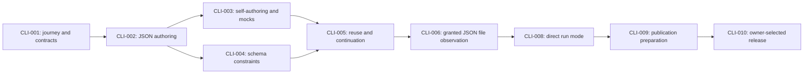

# Programmable CLI board

**Status: CLI-010 repository bootstrap is active; CLI-009 local preparation is complete.**

The owner selected [repository bootstrap](context/cli-010-bootstrap.json) for `apnex/cli`.\
The owner selected [MIT](BACKLOG.md#decision-0002-use-the-mit-license).\
The current release action is [CLI-010](BACKLOG.md#cli-010): commit the prepared source, create the remote, push `main`, and verify its contents and hosted checks.\
The [publication review](publication/REVIEW.md) owns the current sweep, while the [workflow index](README.md) links each implemented capability to its contract and evidence.\
Comparative agent savings remain unmeasured.\
The [vision](../VISION.md) states value, the [target architecture](ARCHITECTURE.md) states responsibility boundaries, and the [backlog](BACKLOG.md) retains selection and disposition history.

## The contract between board and record

Every item on this board cites its durable backlog record.\
The board owns proposed ordering, dependencies, and readiness; the record owns findings, evidence, and disposition history.\
An open record can be ready or waiting, a parked record is held, and a closed record is done.

The project owner selects direction.\
The [first selection exchange](context/cli-001-approval.json), [CLI-002 approval](context/cli-002-approval.json), [CLI-003 approval](context/cli-003-approval.json), and [CLI-004 approval](context/cli-004-approval.json) retain the completed selections; later milestones keep their own readiness and selection boundaries.\
Continue work already authorized by the owner without asking for that authorization again.

Update board and record together when a finding changes state.\
Before reporting consistency, check that identifiers resolve in both directions, states agree, dependencies exist without cycles, and a ready item has no unmet prerequisite.\
Held work keeps its reason and observable trigger in the record.

---

## Triage scale

Score current impact and demonstrated principle breach separately.\
These are author judgments against the cited repository evidence, not measurements of deployed users or product benefits.

| Level | Current impact | Principle breach |
|---|---|---|
| 4 | Observed data loss or uncontrolled external effects. | Demonstrated breach causing irreversible loss of a standing guarantee. |
| 3 | Observed wrong results in an implemented user workflow. | Demonstrated breach of a standing mandate. |
| 2 | A stated authoring, reuse, or continuation workflow is unavailable in the current scaffold. | A required enforcement signal is demonstrably missing from behavior that claims the guarantee. |
| 1 | Internal planning or a capability with no selected concrete consumer. | An unresolved alignment concern, with no breach established. |
| 0 | No remaining impact within the recorded scope. | No demonstrated breach. |

Order by the higher of the two signals while retaining both columns; do not average or combine them into a weighted score.\
Dependencies determine which moves are eligible, so a lower-impact prerequisite can be the next move needed to unlock higher-impact work.\
Break remaining ties by how directly the move tests the construction loop, then reuse and continuation, then by dependency order.

No current row establishes a demonstrated principle breach.\
An explicitly provisional target or diagnostic finding is not a passing implementation claim.\
Priority follows the selected publication workflow and its remaining decisions.

---

## Triage ledger

| Record | Candidate | Impact | Principle breach | Board state | Evidence and priority reason |
|---|---|---|---|---|---|
| [CLI-009](BACKLOG.md#cli-009) | Source publication preparation | 0 | 0 | Done | The [publication review](publication/REVIEW.md) records the four-document set, clean-copy build and tests, literal author/export/run journey, preservation checks, and explicit release holds. |
| [CLI-010](BACKLOG.md#cli-010) | Publish the reviewed source | 2 | 0 | Active | The owner selected `apnex/cli`; the [bootstrap instruction](context/cli-010-bootstrap.json) authorizes the initial source push and verification. |
| [CLI-011](BACKLOG.md#cli-011) | Establish a strict lint gate | 1 | 0 | Held | Strict Clippy exposes an existing error-size design choice and syntax suggestions; the [review](publication/REVIEW.md) retains the failed diagnostic run. |
| [CLI-012](BACKLOG.md#cli-012) | Derive current architecture from verified criteria | 1 | 0 | Held | The [open register](ARCHITECTURE.md#owed-and-open-register) identifies the projection gap; target generation is not current-state derivation. |
| [CLI-008](BACKLOG.md#cli-008) | Direct CLI run mode | 0 | 0 | Done | [Measured run results](run/RESULTS.md) satisfy direct one-shot and actual terminal use, generated views, exact arguments, process status, optional persistent state, and existing invocation/recovery semantics. |
| [CLI-005](BACKLOG.md#cli-005) | Reuse, agent continuation, and workflow evaluation | 0 | 0 | Done | [Fresh-agent continuation](reuse/FRESH-ACTOR-TRIAL.md), [document import](authoring/IMPORT-RESULTS.md), and [local component assembly](components/RESULTS.md) pass their separate scoped checks. Four-method costs and unmeasured actor-effort limits remain explicit. |
| [CLI-004](BACKLOG.md#cli-004) | Schema construction and constrained authoring | 0 | 0 | Done | [Implementation and acceptance](constraints/CLI-004.md) demonstrate schema construction, explicit snapshots, guidance, constrained commits, recovery, and OpenAPI authoring as data. |
| [CLI-003](BACKLOG.md#cli-003) | Self-authored CLI and explicit mocks | 0 | 0 | Done | [Implementation and acceptance](composition/CLI-003.md) demonstrate command-based construction, explicit activation, labeled mocks, transfer, and recovery. |
| [CLI-002](BACKLOG.md#cli-002) | Contextual JSON authoring | 0 | 0 | Done | [Implementation and acceptance](authoring/CLI-002.md) demonstrate the paired journey, precise editing, checkpoint recovery, and bounded results. |
| [CLI-001](BACKLOG.md#cli-001) | First journey and concrete contracts | 0 | 0 | Done | [Design closeout](authoring/CLI-001.md#completion-predicate) establishes the bounded contract; runtime acceptance belongs to CLI-002. |
| [CLI-006](BACKLOG.md#cli-006) | First connected capability | 0 | 0 | Done | [Native JSON reads](connected/RESULTS.md) pass grant, observation, transfer, invalid-input, and recovery checks. Executable hooks and remote or mutating providers retain separate consumer requirements. |
| [CLI-007](BACKLOG.md#cli-007) | OpenAPI-derived invocation | 1 | 0 | Held | [OpenAPI distinction](approach.md#give-a-document-an-explicit-role) preserves description authoring while invocation awaits a concrete API task. |
| [CLI-000](BACKLOG.md#cli-000) | Initial documentation and layer scaffold | 0 | 0 | Done | [Initial scope](project-intent.md#interpretation-of-the-initial-scaffold) is present as local documents and responsibility views. |

---

## Ordered milestones

The table preserves dependency order and the completion boundary of each selected scope.\
Its status is not a second severity scale.\
Ready means available for selection, not that implementation is already authorized by this board.

| Milestone | Record | Status | Depends on | Reviewable completion |
|---|---|---|---|---|
| M1: Establish the first journey | [CLI-001](BACKLOG.md#cli-001) | Done | None | [Task, corpus, contracts, build evidence, and design audit](authoring/CLI-001.md) are retained; runtime execution is recorded separately in CLI-002. |
| M2: Make contextual authoring usable | [CLI-002](BACKLOG.md#cli-002) | Done | CLI-001 | The selected document is authored without raw serialized edits, with precise values, visible drafts, rejected changes, and verified local save and recovery outcomes. |
| M3: Close the CLI construction loop | [CLI-003](BACKLOG.md#cli-003) | Done | CLI-002 | [Paired application journeys](composition/CLI-003.md#acceptance-observations) construct and activate the intended interface, reject failed replacements, and retain mock labels across export and reopen. |
| M4: Apply authored constraints | [CLI-004](BACKLOG.md#cli-004) | Done | CLI-002 | [Paired journeys and upstream cases](constraints/CLI-004.md#acceptance-observations) verify an authored schema governing an instance; a representative OpenAPI description is constructed through commands. |
| M5: Demonstrate reuse and continuation | [CLI-005](BACKLOG.md#cli-005) | Done | CLI-003, CLI-004 | The preserved fresh actor completes the original continuation task; separate component tests and a walkthrough verify local assembly and transfer. Scripted workflow costs and unknown actor costs are reported separately. |
| M6: Connect a concrete read capability | [CLI-006](BACKLOG.md#cli-006) | Done | CLI-003, CLI-005 | The authored interface reads an explicitly granted file, transfers history without authority, preserves mock and authoring state, and recovers observed publication failures under its [contract](connected/CONTRACT.md). |
| M7: Expose configured verbs directly | [CLI-008](BACKLOG.md#cli-008) | Done | CLI-003, CLI-005, CLI-006 | Direct one-shot and interactive calls, generated help/tree/completion, meaningful output and exits, and optional persistent state pass the [run acceptance task](run/acceptance/TASK.md). |
| M8: Prepare source publication | [CLI-009](BACKLOG.md#cli-009) | Done | CLI-008 | The four-document set is coherent, literal consumer and contributor journeys pass, historical evidence remains intact, and publication choices are explicit. |
| M9: Publish reviewed source | [CLI-010](BACKLOG.md#cli-010) | Active | CLI-009 | The owner-selected contents, license, and destination identify a published revision whose checks pass. |

Arrows below mean prerequisite to dependent move.\
M3 and M4 are independent after M2; their ordering expresses the proposed emphasis on the self-authoring loop, not a mandatory product lifecycle.

Collect acceptance examples and comparison costs from M1 onward.\
M5 evaluates accumulated evidence; it does not postpone error recovery, portability, or human and agent semantic parity until the last milestone.

---

## Held

These candidates use the same triage scale as the proposed milestones.\
Their triggers cause reconsideration, not automatic implementation.

| Record | Impact | Principle breach | Why held | Revival trigger |
|---|---|---|---|---|
| [CLI-011](BACKLOG.md#cli-011) | 1 | 0 | No strict lint policy or measured error-path cost justifies a broad protocol refactor. | A consumer needs that gate, or profiling establishes a useful error representation change. |
| [CLI-012](BACKLOG.md#cli-012) | 1 | 0 | Current architecture cannot be inferred from generated target documentation. | A selected architecture delta needs a mechanically verified current/target comparison. |
| [CLI-007](BACKLOG.md#cli-007) | 1 | 0 | API invocation needs a representative interaction and protocol requirements. | An API description and requested CLI task establish mapping, authentication, and response expectations. |

OpenAPI document authoring remains in [CLI-004](BACKLOG.md#cli-004).\
Bounded mock exploration is implemented in [CLI-003](BACKLOG.md#cli-003).

---

## Decisions required

The [first authoring decision](authoring/CLI-001.md#decision-0001-establish-the-bounded-authoring-contract) settles the bounded service-catalog journey, addressing and persistence semantics, and minimum Rust build choices.\
The following entries retain later design work.\
The owner settles product direction; implementation choices follow the selected scope and evidence.

| Decision | Proposed starting point | Exactly what it blocks |
|---|---|---|
| Broader release scope | The selected bootstrap publishes a source repository; package and binary distributions need a concrete consumer and their own release instruction. | Any package-registry or binary release beyond CLI-010. |
| API task for CLI-007 | Select an API description and a useful requested operation, then specify mapping, authentication, and response expectations. | OpenAPI-derived invocation remains held until a concrete task supplies the requirements. |

The first connected read boundary is settled by the [CLI-006 contract](connected/CONTRACT.md) and [measured results](connected/RESULTS.md).\
It does not select an executable-hook protocol or remote/mutating provider guarantees; those extensions require their own concrete consumer.

Complete-document import is settled by its [contract and measured results](authoring/IMPORT-RESULTS.md).\
Local component composition is settled by its [contract](components/CONTRACT.md), [audit](components/AXIOM-AUDIT.md), and [measured results](components/RESULTS.md).\
Nested assemblies, shared mutable component state, version negotiation, and schema composition require a concrete consumer before extending that bounded contract.\
The added import method passes the original staged-state checks; command-only authorship and comparative actor effort remain distinct measurements.

The first schema decision is settled by the [CLI-004 contract](constraints/CONTRACT.md#interpretation): local-2020-12-v1, explicit schema snapshots, local acyclic references, and whole-document validation on commit.

The [architecture's open register](ARCHITECTURE.md#owed-and-open-register) retains the fuller design questions and their consumers.\
The [CLI-003 contract](composition/CONTRACT.md) and [acceptance record](composition/CLI-003.md) settle the first definition vocabulary, activation, and mock semantics within their stated bounds.\
The [working approach](approach.md#evaluate-workflow-value) keeps specification volume separate from workflow value.

---

## Mechanics, rationale, and consequence

### Mechanics

Score evidence-backed candidates, expose dependencies, preserve held work, and attach selection and completion evidence to the corresponding record.

### Rationale

The next actor can identify a useful legal move without reconstructing the discussion or mistaking a scaffold for an implemented capability.

### Consequence of violation

Local convenience can choose the roadmap while the construction workflow, reuse, and continuation claims remain untested.
