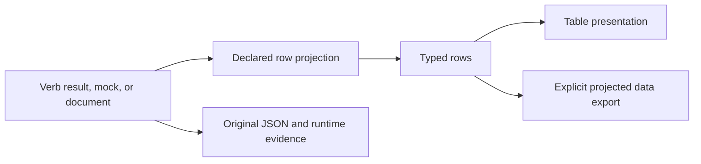

# Configurable command output views

**Tier 3: research assessment by Codex, 2026-09-16.**
Status: a proposal for discussion; no renderer, query language, definition format, or implementation milestone is selected here.

The owner asked to research wrangling and clean tabular output from verbs, using `agp/cli` templates as a reference, and reason about reusable core functionality.
The source records are [AGP behavior](AGP.md) and [current CLI output](CURRENT-CLI.md).
Local test/probe evidence is retained under [command-output-views evidence](../../evidence/command-output-views/).

**Later selection:** the owner chose AGP's two views as the first consumer and required native Rust execution.\
The [selected contract](../../output-views/CONTRACT.md) and [implementation results](../../output-views/RESULTS.md) continue this research; the proposal below retains its original scope and assessment.

## Recommendation

Make an **output view** an inspectable, reusable definition that describes how structured data becomes a useful presentation.
The kernel would execute that definition for a verb result, a mock result, or an explicitly selected authoring document.
The construction workflow should support creating, previewing, revising, and exporting the view through contextual authoring.

Keep three concepts explicit:

| Concept | Responsibility | Example |
|---|---|---|
| Structured result | Preserve the original typed data and runtime evidence. | A connection document with nested timers and capture metadata. |
| Projection | Select rows, extract fields, filter, order, and derive typed values using declared rules. | One row per connection; obtain remaining milliseconds from its armed hold timer. |
| Presentation | Turn those values into cells, headers, units, alignment, and terminal layout. | Show remaining milliseconds as rounded-up seconds in a `TTL` column. |

This division follows the separable stages measured in [AGP](AGP.md#source-findings), while retaining the exact-value and outcome boundaries recorded for [CLI](CURRENT-CLI.md).
The original result must remain accessible; table formatting must not become the stored invocation result.

## Candidate definition content

These are capabilities to evaluate, not field names or accepted syntax.

| Declaration | Purpose |
|---|---|
| Stable view identity and description | Discover, reference, export, and reuse a view. |
| Expected input shape and row selection | Distinguish an array root, an envelope collection, a keyed object, and a single record; reject an incompatible input rather than imply an empty result. |
| Ordered columns | Declare stable column identity, heading, typed field selection, missing/null behavior, formatter, and alignment. |
| Projection operations | Bounded nested selection, conditional values, list selection, root-document references, comparisons, joining, and explicit ordering. AGP route markers require access beyond the current row. |
| Display policy | Define empty results, width, wrapping/truncation, units, and color preferences separately from data transformations. |
| Command association | Reference default and alternative views from a command; the same view can be previewed before a binding exists. |
| Examples and requirements | Carry representative input and required capabilities so another agent can inspect, preview, and continue construction. |

For example, a connection view could be described without raw JSON:

| Setting | Illustrative value |
|---|---|
| Rows | The result's `items` collection |
| `SESSION` | `sessionId`, falling back to `localSessionId` |
| `PEER` | `remoteNodeId`; display a dash when absent |
| `STATE` | `state` |
| `UPTIME` | `establishedDurationMs`; duration formatting when established |
| `TTL` | `remainingMs` from the armed hold timer; round upward for a seconds display |

The authoring journey would be: create the view, enter its columns, add field selections and formatters, preview against a chosen fixture, attach it to a verb, then export the CLI.
Another agent would receive the view's meaning, sample input, and dependencies along with the interface.
This workflow is a proposed extension; the current CLI rejects undeclared definition fields.

## Fit within the existing responsibilities

| Responsibility | Proposed contribution |
|---|---|
| Document and authoring | Construct and edit view definitions as data; preview from a selected document without mutating that document. |
| Constraints and definitions | Validate view shapes, expressions, references, and command associations; include requirements in portable composition. |
| Bindings and runtime | Produce and retain structured outcomes with their existing effect and observation identities. A provider need not print a table. |
| Interaction | Evaluate the chosen view and render cells; expose original data, projected data, and presentation errors explicitly. |

A new top-level architectural layer is not required by this proposal.
A pure projection engine could be shared internally; module/crate placement should follow an implemented consumer.
Network field names, route eligibility rules, and service health policies belong in domain definitions or providers.
Generic path traversal, bounded selection, exact-value handling, and table layout are candidates for shared mechanism.

## Use cases to test reuse

| Consumer | Result and useful view | What it tests |
|---|---|---|
| AGP connections and routes | Peers, state, durations, route markers, and paths | Nested selection, root/row references, and domain formatters. |
| CLI's own verb catalog | Context, verb, parameters, binding, and capability requirement | A second actual data surface; reusable layout without networking assumptions. |
| Authored JSON or service inventory | Selected fields from a collection, with stable ordering | The same view engine outside operation invocation. |
| Schema validation | Document path, schema path, keyword, and message | Long text, empty success, grouped diagnostics, and inspectable detail. |
| Candidate changes | Path, change kind, before, and after | Missing versus null, nested values, and explicit truncation. |
| Job/build results | ID, status, elapsed time, attempt, and failure reason | Saved results, state labels, and durations. This remains an example consumer, not an existing connected provider. |

Tables should remain one presentation among several. Deep trees can retain JSON/tree views, and a single result can use a detail view.
Agents could request typed projected rows for concise reasoning and fetch the original for detail. Reduced effort or token use remains a hypothesis to measure.

## Boundaries that determine correctness

- **Typed data before display.** Preserve booleans, nulls, and exact number tokens. Sort numeric values before formatting. The [local numeric probe](AGP.md#executed-observations) demonstrates why display strings cannot be a general data interface. Computed arithmetic still needs its own precision and rounding contract.
- **Explicit completeness.** Missing, null, empty, and wrong-shaped inputs need distinct semantics. Filters, row limits, truncation, and partial source pages must be visible; an empty view is not proof the source was empty. Sorting a loaded page must not imply sorting an entire remote collection.
- **Reproducible results.** Stable row ordering and explicit locale, timezone, width, and reference time determine repeatable output. Prefer supplied elapsed durations; a saved snapshot's TTL must not silently use the current clock.
- **One execution, multiple views.** Preview or re-render a retained result without invoking its verb again. A presentation failure after a successful operation must preserve the operation's outcome and permit recovery without repeating its effects. Retention and re-render controls need an explicit contract; the current last-result field is not a full result archive.
- **Existing machine contract.** Default run output is currently exact payload JSON; `--json` is the full response envelope. Preserve both meanings. Introduce tables through explicit view selection first; any new defaults need a documented compatibility decision.
- **Runtime evidence survives presentation.** Preserve simulation labels, observation identity, and access to complete outcomes. A template cannot relabel a mock as observed or conceal an execution failure.
- **Bounded interpretation.** View evaluation operates on supplied data with limits on work, rows, and output size. Terminal controls, Unicode display widths, newlines, and absent color support belong to the shared renderer. A view should not acquire file/network/process authority merely by being loaded.
- **Reuse has identity.** View references, formatter semantics, and required input shape travel with exported/assembled definitions. Because saved runs check definition identity, changing only a view still needs a deliberate version/activation policy.

## External precedents: documented claims

These are official documentation observations, accessed 2026-09-16, not local implementation audits.

| Tool | Documented behavior | Relevant question |
|---|---|---|
| GitHub CLI | JSON field selection, `--jq`, and Go templates; table rows, time formatting, truncation, and terminal-aware color helpers. | How much projection and formatting vocabulary do consumers need? [Official formatting manual](https://cli.github.com/manual/gh_help_formatting) |
| Docker CLI | Go templates with field selection and functions including join, table, JSON, padding, and truncation. | How should saved views avoid repeated shell quoting? [Official formatting guide](https://docs.docker.com/engine/cli/formatting/) |
| kubectl | Inline/file custom columns, JSON and wide output, numeric/string sorting, and server-supplied table columns. | Should response shape, standard views, and caller-selected views remain separate? [Official output options](https://kubernetes.io/docs/reference/kubectl/#output-options) |

These demonstrate several existing surfaces, not compatibility requirements for this project.

## Next experiment and open choices

Recommended next experiment: author two portable views through commands, one for an AGP connection fixture and one for CLI command discovery; preview, export, import, and render both through the same Rust mechanism.
Use offline/mock data first so presentation can be evaluated independently of provider development.
Include a route fixture before claiming that simple per-row paths cover AGP's template behavior.

An initial vocabulary should cover ordered columns, typed paths, explicit missing values, and the bounded selectors/formatters required by those consumers.
Add grouping, aggregation, joins, streaming, watch mode, and further export formats when a concrete task supplies their semantics.
Existing Bash/jq templates are the behavioral reference; this research selects no shell dependency, Rust rendering crate, or full jq interpreter.

Choices still open:

1. Structured expression definitions, an embedded expression language, or a bounded combination. Structured definitions best support contextual construction; full language support adds syntax, resource, and compatibility obligations.
2. The first consumer beyond AGP: the proposed CLI catalog, a user-selected inventory, or another concrete result.
3. View selection controls, command defaults, and definition-version handling. Kernel controls must retain the current separation from configured domain verbs.

Completion of the experiment would require unchanged original results, explicit projection failures, preserved mock labels, reproducible fixture output, and a successful author/export/import/run journey with no manual JSON editing.
No BOARD item or product behavior is changed by this research record.
